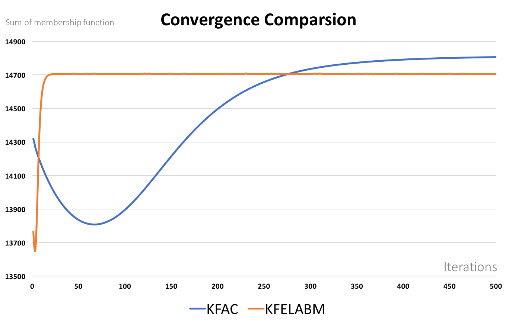
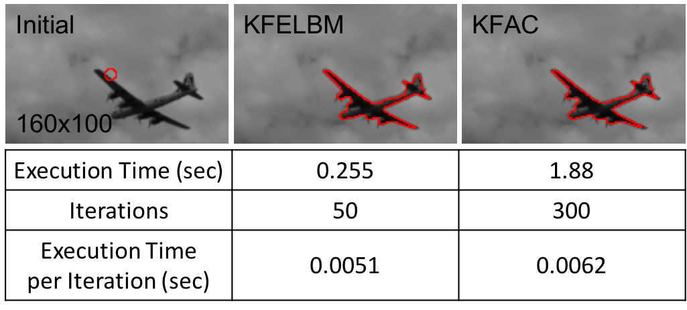

# Kerenl Fuzzy Active Contour using Lattice Boltzmann Method

This repository contains several versions of implementation of my [thesis](http://etd.lib.nctu.edu.tw/cgi-bin/gs32/hugsweb.cgi?o=dnthucdr&s=id=%22G021040125380%22.&searchmode=basic).
## Execution Environment

Operating System: ubuntu 16.04 LTS 64-bit 
Central Processing Unit: Intel® Core™ i7-6700HQ CPU @ 2.60GHz × 8  
Graphics Processing Units: GeForce GTX 965M/PCIe/SSE2

## Abstract

Fast and accurate image segmentation is still a challenging task in computer vision because real-world images are often distorted by noise and intensity inhomogeneity. In order to overcome these problems, fuzzy clustering is extensively applied to image segmentation because of the strong ability to reject local minimum. It also incorporates with kernel metrics to enhance robustness against noise and outliers and construct a nonlinear energy function based on a variational level set framework. However, level set implementation often costs a lot of CPU times, and needs “re-initialization” or regularizing terms to keep level set function smooth and stable. 

Our research provides the algorithm which solve level set equation of kernel fuzzy active contour model by using Lattice Boltzmann Method solver. Lattice Boltzmann Method can recover the level set PDE by computing pixel-by-pixel independently and maintain the stability and smoothness of level set function in the meanwhile. Therefore, this algorithm is fast, stable and independent to the position of the initial curve. Experiments on synthetic and real-world images demonstrate the stability and performance of the proposed method, and also show
the efficiency of algorithm by using graphics processing unit. 

Key words: active contour model, fuzzy clustering, lattice boltzmann method, level set method, kernel
## Details

There are three main files in this repository.
### Implement on CPU

- KFAC.cpp  

> This file implement *[Novel fuzzy active contour model with kernel metric for image segmentation (KFAC)](https://www.sciencedirect.com/science/article/pii/S1568494615002951)* in differential method.  

- KFELBM_cpu.cpp  

> This file implement my thesis *Kerenl Fuzzy Active Contour using Lattice Boltzmann Method (KFELBM)* in CPU version.

### Implement on GPU
- KFELBM_gpu.cu

> This file implement my thesis *Kerenl Fuzzy Active Contour using Lattice Boltzmann Method (KFELBM)* in GPU version using CUDA.

 

## Result

Here are some results from my thesis. If you want to know more details, you can find them in [my thesis](http://etd.lib.nctu.edu.tw/cgi-bin/gs32/hugsweb.cgi?o=dnthucdr&s=id=%22G021040125380%22.&searchmode=basic). 

### Convergence 
This image shows the iterations, which KFAC and KFELBM needs to converge.  
Due to different convergence situation, we set different iterations in KFAC and KFELBM algorithm, which is **300** and **50** respectively.  

  

### Final Contour & Execution Time Comparsion
This image shows the final contour and execution time from KFAC and KFELBM.  
You can find a more elegant contour in my thesis by using matlab for visualization. 

  

## Visualization

For data visualization, we use MATLAB R2016a to film the membership function varying with time to show how the level set function change implicitly in KFAC and KFELBM algorithm. The KFELBM run in a valid CPU version, just like KFELBM.cpp. The matlab code is in the [mat](./mat) folder.

### Files
There are two folders in mat, *KFAC* and *KFELBM*.  

*KFAC*
 
- KFAC_film.m  

> main file for creating .avi film.

- KFAC.m  

> function file for updating membership function in differential method.

 

 *KFELBM*
 
- KFELBM_film.m

> main file for creating .avi film.

- Force.m

> function file for updating external force from fuzzy energy.

- LBM.m

> function file for updating membership function by using lattice boltzmann method

### Output
This gif below are membership function varying with time in **KFAC**.  

 
 
This gif below are membership function varying with time in **KFELBM**.  

## Acknowledgments

Thanks professor Ching-Han Hsu for instruction and advice.
